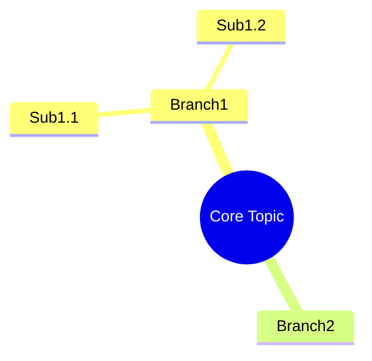

# NotebookLM Studio

Generate structured learning materials from notebook sources.

## Dependencies
- notebooklm-core skill

## Tool Mapping

| User Request | Tool | Output |
|-------------|------|--------|
| "generate mindmap" | mindmap | Mermaid code |
| "generate flashcards" | flashcards | Markdown Q&A |
| "generate report" | report | Markdown |
| "generate timeline" | timeline | Markdown table |

## General Process
1. Get current notebook sources (via notebooklm-core)
2. Build tool-specific prompt
3. Call LLM to generate content
4. Save to `~/pi-cwd-20260526/notebooklm_data/exports/`
5. Return file path + preview

### Mindmap
Prompt:
```
Convert these materials into a hierarchical mindmap.
Return STRICT Mermaid syntax:

Max 3 levels, 2-6 chars per node, cover 80%+ core concepts.
```
Save: `{notebook_id}_mindmap.mmd`

### Flashcards
Prompt:
```
Generate 10 flashcards from these materials.
Format (STRICT):
---
Q: [question]
A: [answer, max 50 chars]
Source: [filename, page]
Difficulty: [easy/medium/hard]
---
Cover core concepts, definitions, key data.
```
Save: `{notebook_id}_flashcards.md`

### Report
Prompt:
```
Generate a {style} report from these materials.
Structure:
# Title
## Abstract (200 words)
## Introduction
## Body (with subsections)
## Conclusion
## References
All claims must cite sources (filename, page).
```
Styles: academic (rigorous), business (actionable), concise (bullet points)
Save: `{notebook_id}_report.md`

### Timeline
Extract time-related events, sort chronologically.
Format: Markdown table | Time | Event | Source |
Save: `{notebook_id}_timeline.md`

## Citation
Same as notebooklm-core. All generated content must cite sources.