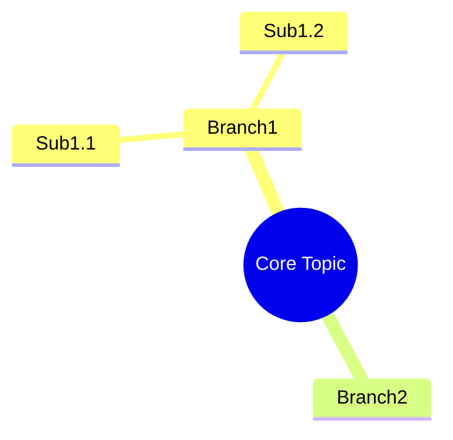

# PROMPT FOR CLAUDE CODE / PI-WEB
# ============================================
# PROJECT: NotebookLM Agent (NLA)
# DEADLINE: 1 day (2026-05-29)
# TARGET: Personal use, local deployment
# PRINCIPLE: Zero intrusion to pi-web core, pure Skill extension
# ============================================

You are a senior full-stack developer implementing the NotebookLM Agent based on the following PRD and Architecture documents. Follow vibecoding workflow strictly: only modify named files, no refactoring, no style changes, no unrelated logic changes.

## CONTEXT

User environment:
- pi-web (@agegr/pi-web) running on localhost:30141
- Windows 10+
- Python 3.10+ available
- Existing skills: pdf, edge-tts, codex-cli-runtime, tavily-search, find-keywords, image-tools, gpt-5-4-prompting
- Working directory: ~/pi-cwd-20260526/
- Skill directory: C:\Users\mec\.pi\agent\skills\

## DELIVERABLES (in order)

### STEP 1: Install Dependencies (10 min)

Run these commands via bash tool in pi-web:

```bash
pip install chromadb sentence-transformers pdfplumber beautifulsoup4 requests
```

Verify:
```bash
python -c "import chromadb, sentence_transformers, pdfplumber, bs4; print('OK')"
```

Check ffmpeg:
```bash
ffmpeg -version
```
If not found, tell user to run: `choco install ffmpeg`

Create directories:
```bash
mkdir -p ~/pi-cwd-20260526/notebooklm_data/{sources,chunks,chroma_db,notebooks,exports,scripts}
```

### STEP 2: Create Python Scripts (1h)

Create these files in `~/pi-cwd-20260526/notebooklm_data/scripts/`:

#### scripts/parse_pdf.py
```python
import sys, json, pdfplumber

def parse_pdf(file_path):
    pages = []
    with pdfplumber.open(file_path) as pdf:
        for i, page in enumerate(pdf.pages):
            text = page.extract_text()
            if text and text.strip():
                pages.append({"page": i+1, "text": text.strip()})
    return pages

if __name__ == "__main__":
    print(json.dumps(parse_pdf(sys.argv[1]), ensure_ascii=False))
```

#### scripts/chunk_text.py
```python
import sys, json

def chunk_text(pages, chunk_size=450, overlap=50):
    chunks = []
    current_text = ""
    current_pages = []

    for p in pages:
        paragraphs = p["text"].split('\n')
        for para in paragraphs:
            para = para.strip()
            if not para:
                continue
            if len(current_text) + len(para) < chunk_size:
                current_text += para + "\n"
                if p["page"] not in current_pages:
                    current_pages.append(p["page"])
            else:
                if current_text.strip():
                    chunks.append({
                        "text": current_text.strip(),
                        "pages": current_pages.copy(),
                        "index": len(chunks)
                    })
                current_text = para + "\n"
                current_pages = [p["page"]]

    if current_text.strip():
        chunks.append({
            "text": current_text.strip(),
            "pages": current_pages,
            "index": len(chunks)
        })

    return chunks

if __name__ == "__main__":
    data = json.loads(sys.argv[1])
    print(json.dumps(chunk_text(data), ensure_ascii=False))
```

#### scripts/embed_store.py
```python
import sys, json, os
from sentence_transformers import SentenceTransformer
import chromadb

MODEL = SentenceTransformer('all-MiniLM-L6-v2')
DB_PATH = os.path.expanduser("~/pi-cwd-20260526/notebooklm_data/chroma_db")

def embed_and_store(notebook_id, source_id, filename, chunks):
    client = chromadb.PersistentClient(path=DB_PATH)
    collection = client.get_or_create_collection(f"notebook_{notebook_id}")

    texts = [c["text"] for c in chunks]
    embeddings = MODEL.encode(texts).tolist()

    collection.add(
        ids=[f"{source_id}_chunk_{i}" for i in range(len(chunks))],
        embeddings=embeddings,
        documents=texts,
        metadatas=[{
            "source_id": source_id,
            "filename": filename,
            "pages": json.dumps(c["pages"]),
            "chunk_index": c["index"]
        } for c in chunks]
    )
    return {"status": "ok", "chunks_stored": len(chunks)}

def search(notebook_id, query, top_k=5, threshold=0.3):
    client = chromadb.PersistentClient(path=DB_PATH)
    collection = client.get_collection(f"notebook_{notebook_id}")

    query_embed = MODEL.encode([query]).tolist()
    results = collection.query(
        query_embeddings=query_embed,
        n_results=top_k,
        include=["documents", "metadatas", "distances"]
    )

    output = []
    for i in range(len(results["documents"][0])):
        dist = results["distances"][0][i]
        if dist < threshold:
            output.append({
                "text": results["documents"][0][i],
                "metadata": results["metadatas"][0][i],
                "distance": dist
            })
    return output

if __name__ == "__main__":
    action = sys.argv[1]
    if action == "store":
        result = embed_and_store(sys.argv[2], sys.argv[3], sys.argv[4], json.loads(sys.argv[5]))
    elif action == "search":
        result = search(sys.argv[2], sys.argv[3], int(sys.argv[4]) if len(sys.argv) > 4 else 5)
    print(json.dumps(result, ensure_ascii=False))
```

#### scripts/notebook_manager.py
```python
import sys, json, os, time

DATA_DIR = os.path.expanduser("~/pi-cwd-20260526/notebooklm_data")
DB_FILE = os.path.join(DATA_DIR, "notebooks.json")

def load_db():
    if os.path.exists(DB_FILE):
        with open(DB_FILE, 'r', encoding='utf-8') as f:
            return json.load(f)
    return {
        "active_notebook": "default",
        "notebooks": {
            "default": {
                "id": "default",
                "name": "Default Notebook",
                "created_at": time.strftime("%Y-%m-%dT%H:%M:%SZ"),
                "sources": [],
                "chat_history": [],
                "settings": {"context_mode": "auto"}
            }
        }
    }

def save_db(db):
    with open(DB_FILE, 'w', encoding='utf-8') as f:
        json.dump(db, f, ensure_ascii=False, indent=2)

def create_notebook(name):
    db = load_db()
    nb_id = f"nb_{int(time.time())}"
    db["notebooks"][nb_id] = {
        "id": nb_id,
        "name": name,
        "created_at": time.strftime("%Y-%m-%dT%H:%M:%SZ"),
        "sources": [],
        "chat_history": [],
        "settings": {"context_mode": "auto"}
    }
    save_db(db)
    return db["notebooks"][nb_id]

def add_source(notebook_id, file_path, title=""):
    db = load_db()
    src_id = f"src_{int(time.time())}"
    filename = os.path.basename(file_path)

    source = {
        "id": src_id,
        "notebook_id": notebook_id,
        "filename": filename,
        "title": title or filename,
        "type": "pdf" if filename.endswith('.pdf') else "txt",
        "added_at": time.strftime("%Y-%m-%dT%H:%M:%SZ")
    }

    db["notebooks"][notebook_id]["sources"].append(source)
    save_db(db)
    return source

def get_active():
    db = load_db()
    return db["notebooks"][db["active_notebook"]]

if __name__ == "__main__":
    action = sys.argv[1]
    if action == "create":
        result = create_notebook(sys.argv[2])
    elif action == "add_source":
        result = add_source(sys.argv[2], sys.argv[3], sys.argv[4] if len(sys.argv) > 4 else "")
    elif action == "get_active":
        result = get_active()
    print(json.dumps(result, ensure_ascii=False))
```

### STEP 3: Create Skills (1h)

Create these files:

#### C:\Users\mec\.pi\agent\skills\notebooklm-core\SKILL.md

```markdown
---
name: notebooklm-core
description: NotebookLM Core - Source management, RAG retrieval, citation-based Q&A. All answers must cite sources.
version: 1.0.0
---

# NotebookLM Core

You are the NotebookLM Core assistant. Manage research Sources and answer questions based ONLY on uploaded documents.

## Data Directory
`~/pi-cwd-20260526/notebooklm_data/`

## Environment Check
Before any operation, verify dependencies:
```bash
python -c "import chromadb, sentence_transformers, pdfplumber, bs4" 2>&1 || echo "MISSING_DEPS"
```
If missing, prompt user to run: `pip install chromadb sentence-transformers pdfplumber beautifulsoup4 requests`

## Core Workflows

### Add Source
When user uploads a file or provides a path:

1. Save file to `~/pi-cwd-20260526/notebooklm_data/sources/{notebook_id}/`
2. Parse:
   - PDF: `python ~/pi-cwd-20260526/notebooklm_data/scripts/parse_pdf.py "{file_path}"`
   - TXT: Read directly
3. Chunk: `python ~/pi-cwd-20260526/notebooklm_data/scripts/chunk_text.py '{json}'`
4. Embed & Store: `python ~/pi-cwd-20260526/notebooklm_data/scripts/embed_store.py store {notebook_id} {source_id} "{filename}" '{chunks_json}'`
5. Update notebooks.json via notebook_manager.py
6. Return: "Added {title} ({filename}), X pages, Y chunks"

### Grounded Chat
When user asks a question:

1. Get active notebook: `python notebook_manager.py get_active`
2. Search: `python embed_store.py search {notebook_id} "{query}" 5`
3. If no results above threshold 0.3, say "No relevant sources found in current notebook"
4. Build context with retrieved chunks
5. Generate answer with citations

### Citation Format (MANDATORY)
- Single source: `(filename.pdf, page 3)`
- Multiple sources: `(file1.pdf page 3; file2.txt chunk 1)`
- Uncertain: `(Cannot determine from current sources)`

## Forbidden
- Do NOT answer questions unrelated to current notebook sources
- Do NOT fabricate information not in sources
- Do NOT guess page numbers (use "chunk X" if no page)

## Triggers
- "upload file" / "add source" / "add document"
- "based on my sources" / "according to the paper"
- "create notebook" / "switch notebook"
- "summarize this" / "explain this section"
```

#### C:\Users\mec\.pi\agent\skills\notebooklm-podcast\SKILL.md

```markdown
---
name: notebooklm-podcast
description: Audio Overview - Convert notebook sources into dual-host podcast dialogue. Reuses edge-tts skill.
version: 1.0.0
---

# NotebookLM Podcast

Generate podcasts from notebook sources. Two hosts: Alex (male) and Sam (female).

## Dependencies
- notebooklm-core skill
- edge-tts skill
- ffmpeg (system)

## Triggers
- "generate podcast" / "audio overview" / "make podcast"
- "convert to audio" / "I want to listen to this"

## Parameters
- focus: topic to focus on (optional, default "all content")
- duration: short(5min) / medium(15min) / long(30min), default medium
- style: casual / academic / storytelling, default casual
- language: auto-detect from sources or user specify

## Process

1. Get sources from active notebook (via notebooklm-core)
2. Generate script via LLM:
   ```
   Convert these research materials into a podcast dialogue between Alex (male) and Sam (female).
   Style: {style}, Duration: {duration}, Focus: {focus}
   Requirements:
   - 30s intro: self-intro + topic
   - Discuss core ideas with specific data/quotes
   - Natural speech: "um", "ah", "you know", laughter, surprise
   - Hosts have disagreements, not one-sided
   - 30s outro: summary + "thanks for listening"
   - Word count: {words}

   Format (STRICT):
   Alex: [line]
   Sam: [line]
   ...
   ```

   Word counts: short=800, medium=2000, long=4000

3. Parse dialogue lines
4. Generate audio per line using edge-tts:
   - Alex: `uvx edge-tts --voice "zh-CN-YunyangNeural" --file line.txt --write-media alex_X.mp3`
   - Sam: `uvx edge-tts --voice "zh-CN-XiaoxiaoNeural" --file line.txt --write-media sam_X.mp3`
   - English: en-US-GuyNeural (Alex), en-US-JennyNeural (Sam)

5. Merge with ffmpeg:
   ```bash
   ffmpeg -f concat -safe 0 -i filelist.txt -acodec libmp3lame -q:a 2 output.mp3
   ```

6. Save to `~/pi-cwd-20260526/notebooklm_data/exports/{notebook_id}_podcast.mp3`
7. Return: file path + full script + estimated duration

## Limitations
- Only use current notebook sources
- No fabricated viewpoints
- If no sources, prompt "Please add sources first"
- If edge-tts fails, return script text + installation guide
```

#### C:\Users\mec\.pi\agent\skills\notebooklm-studio\SKILL.md

```markdown
---
name: notebooklm-studio
description: Studio toolkit - Mindmap, flashcards, report, timeline generation from notebook sources.
version: 1.0.0
---

# NotebookLM Studio

Generate structured learning materials from notebook sources.

## Dependencies
- notebooklm-core skill

## Tool Mapping

| User Request | Tool | Output |
|-------------|------|--------|
| "generate mindmap" | mindmap | Mermaid code |
| "generate flashcards" | flashcards | Markdown Q&A |
| "generate report" | report | Markdown |
| "generate timeline" | timeline | Markdown table |

## General Process
1. Get current notebook sources (via notebooklm-core)
2. Build tool-specific prompt
3. Call LLM to generate content
4. Save to `~/pi-cwd-20260526/notebooklm_data/exports/`
5. Return file path + preview

### Mindmap
Prompt:
```
Convert these materials into a hierarchical mindmap.
Return STRICT Mermaid syntax:

Max 3 levels, 2-6 chars per node, cover 80%+ core concepts.
```
Save: `{notebook_id}_mindmap.mmd`

### Flashcards
Prompt:
```
Generate 10 flashcards from these materials.
Format (STRICT):
---
Q: [question]
A: [answer, max 50 chars]
Source: [filename, page]
Difficulty: [easy/medium/hard]
---
Cover core concepts, definitions, key data.
```
Save: `{notebook_id}_flashcards.md`

### Report
Prompt:
```
Generate a {style} report from these materials.
Structure:
# Title
## Abstract (200 words)
## Introduction
## Body (with subsections)
## Conclusion
## References
All claims must cite sources (filename, page).
```
Styles: academic (rigorous), business (actionable), concise (bullet points)
Save: `{notebook_id}_report.md`

### Timeline
Extract time-related events, sort chronologically.
Format: Markdown table | Time | Event | Source |
Save: `{notebook_id}_timeline.md`

## Citation
Same as notebooklm-core. All generated content must cite sources.
```

### STEP 4: Load Skills in pi-web (5 min)

1. Open pi-web (localhost:30141)
2. Click "Skills" button at bottom left
3. Click "+ Add skill"
4. Select and enable: notebooklm-core, notebooklm-podcast, notebooklm-studio

### STEP 5: Test (30 min)

Test sequence:
1. New chat session
2. Say: "Create a notebook called AI Research"
3. Upload a PDF file (drag to chat or provide path)
4. Ask: "What is the main contribution of this paper?"
5. Verify answer has citation like `(paper.pdf, page 3)`
6. Say: "Generate a podcast"
7. Verify MP3 file created in exports/
8. Say: "Generate mindmap"
9. Verify .mmd file created

## CONSTRAINTS

- ONLY modify files in:
  - `~/pi-cwd-20260526/notebooklm_data/`
  - `C:\Users\mec\.pi\agent\skills\notebooklm-core/`
  - `C:\Users\mec\.pi\agent\skills\notebooklm-podcast/`
  - `C:\Users\mec\.pi\agent\skills\notebooklm-studio/`
- Do NOT modify pi-web core code
- Do NOT modify existing skills (pdf, edge-tts, etc.)
- Do NOT change UI styles
- Do NOT refactor unrelated logic
- If error occurs: add logging, identify root cause, fix minimally
- Use git to rollback if changes go wrong

## SUCCESS CRITERIA

- [ ] PDF upload -> parse -> chunk -> embed completes in < 30s
- [ ] Grounded chat answers with accurate citations
- [ ] Podcast generates playable MP3 in < 5min
- [ ] Mindmap/flashcards/report generate valid output files
- [ ] All data persists across pi-web sessions

## REPORT BACK

After each step, update project_state.md with:
- What was completed
- Any blockers or errors
- Next step plan
